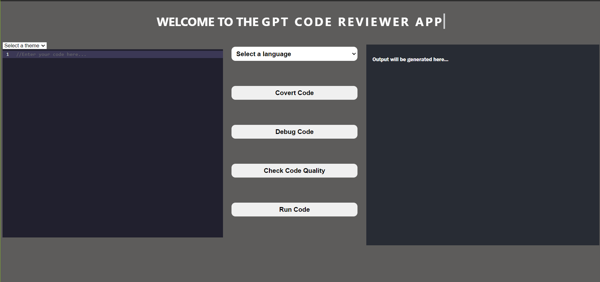

# GPT-Code-Editor-App

CodeMaster is your go-to tool for code conversion, debugging, and code quality analysis. Whether you need to transform code from one language to another, identify and resolve bugs, or ensure top-notch code quality, CodeMaster has you covered.

## Getting Started

To get started with CodeMaster, follow these steps:

1. *Clone the repository:* `git clone https://github.com/your-username/GPT-Code-Editor-App.git`
2. *Install dependencies:* `npm install` 
3. *Run CodeMaster:* `npm start` 

## Usage

1. *Code Conversion:* Enter the code you want to convert and select the target language.
2. *Debugging:* Upload your code, and CodeMaster will automatically identify and highlight any issues.
3. *Code Quality Assessment:* Analyze your code's quality and receive suggestions for improvement.

## Screenshots

Here are some screenshots of code reviwer app in action:

